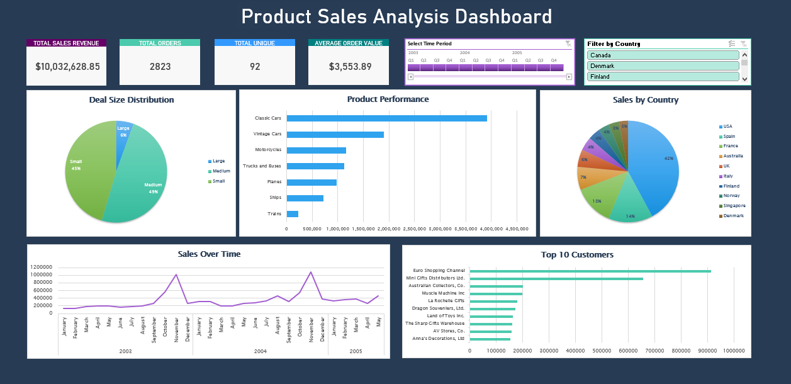
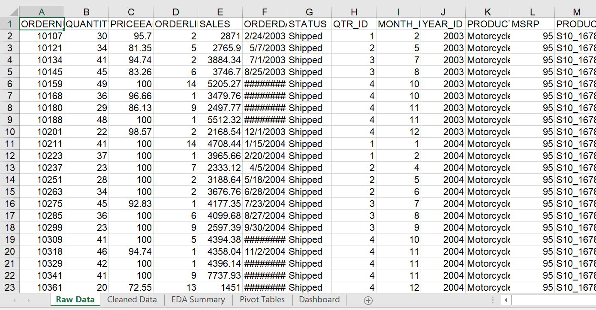
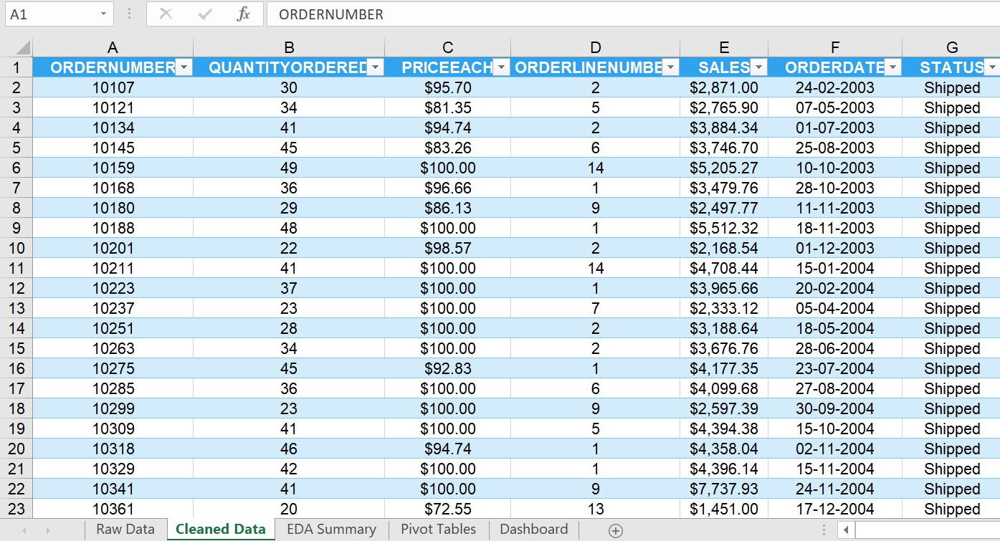
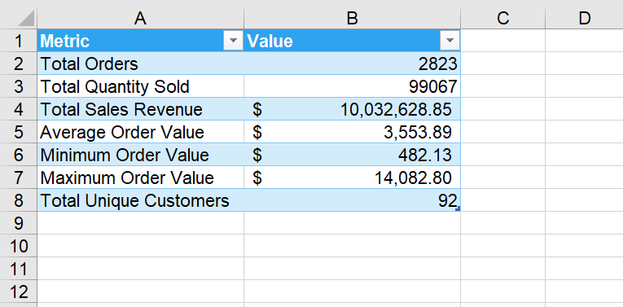
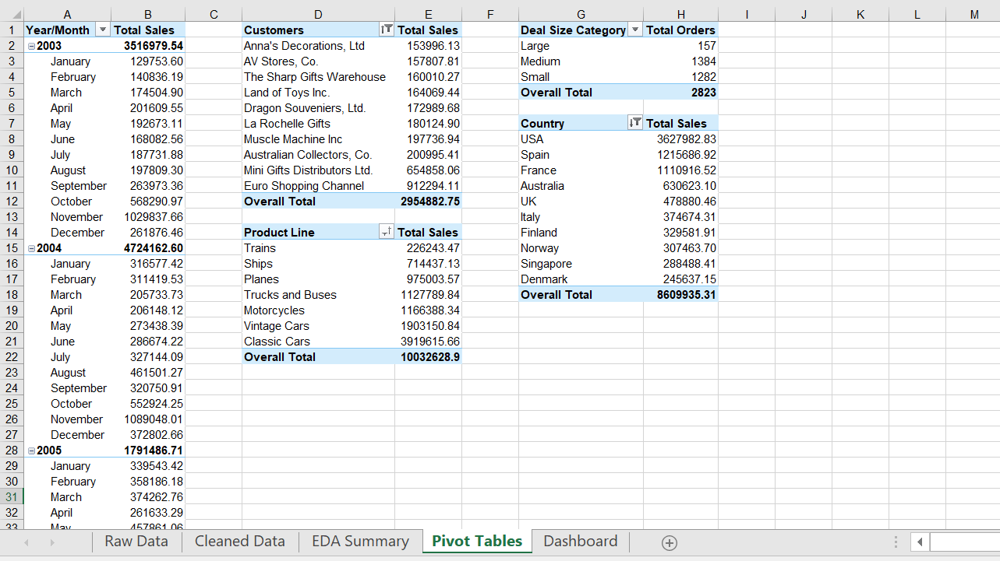

# 📊 Excel Sales Analysis Dashboard

## 📌 Project Overview
This project is a comprehensive **Sales Analysis Dashboard** built in **Microsoft Excel**, designed to analyze and visualize sales performance using various **data analysis and visualization techniques**. The goal is to transform raw data into actionable insights through **cleaning, exploration, and visualization**.

---

## 🛠️ Technologies Used
- **Microsoft Excel**
- **Pivot Tables & Charts**
- **Data Cleaning & Transformation**
- **Conditional Formatting**
- **Slicers for Interactive Filtering**

---

## 📂 Project Structure

1. **Raw Data** - Unprocessed dataset containing sales transactions.
  
2. **Cleaned Data** - Standardized and formatted dataset with structured columns.
  
3. **EDA & Summary Metrics** - Key sales statistics and exploratory data analysis (EDA).
 
4. **Pivot Tables & Charts** - Aggregated data for deep analysis.
  
5. **Final Dashboard** - Interactive dashboard with visual KPIs and slicers.
  
---

## 🔍 Data Processing Steps

### 1️⃣ Data Cleaning & Formatting
- Fixed inconsistent date formats.
- Applied proper number formatting for sales and quantities.
- Removed duplicates and missing values.

📌 **Tools Used:** Text Functions, Find & Replace, Data Validation.

### Before Cleaning:

### After Cleaning:

### 2️⃣ Exploratory Data Analysis (EDA)
- **Calculated Key Metrics:**
  - Total Orders
  - Total Quantity Sold
  - Total Sales Revenue
  - Average Order Value
  - Maximum & Minimum Order Value
  - Total Unique Customers
- **Data Cleaning & Standardization**
- **Conditional Formatting to Highlight Trends**

📌 **Tools Used:** `SUM`, `COUNT`, `AVERAGE`, Conditional Formatting.

### 3️⃣ Pivot Tables & Aggregation
- **Created Pivot Tables to Analyze:**
  - Sales Performance by **Product Line**, **Customer**, and **Country**
  - Monthly and Quarterly **Sales Trends**
  - Deal Size Distribution by Category
- **Used Pivot Tables for Aggregation & Filtering.**
- **Prepared Data for Final Dashboard Visuals.**

📌 **Tools Used:** Pivot Tables, Data Grouping, Sorting, Filtering.

### 4️⃣ Dashboard & Data Visualization
- **Sales Trends Over Time:** Line chart of monthly/quarterly sales trends.
- **Top 10 Customers:** Bar chart of total purchases per customer.
- **Product Performance:** Bar chart of revenue per product line.
- **Sales Distribution by Country:** Pie chart showing sales share per country.
- **Deal Size Distribution:** Pie chart of deal sizes.
- **Main KPI Cards:** Total Orders, Total Sales, Average Order Value, etc.
- **Slicers for Dynamic Filtering:** **Quarter and Country.**

📌 **Tools Used:** Pivot Charts, Line Charts, Bar Charts, Pie Charts, Slicers, KPI Cards, Formatting.

---

## 📊 Key Insights
- **Peak Sales Periods:** Identified highest revenue months.
- **Top-Selling Product Lines:** Classic Cars & Vintage Cars had the highest sales.
- **High-Value Customers:** Top 10 customers accounted for a significant portion of revenue.
- **Geographic Trends:** The USA led in sales, followed by Spain and France.

📌 **Next Steps:** Potential to integrate **Power Query for automation**, **forecasting models**, and **Monte Carlo simulations** for predictive analytics.

---

## 🚀 How to Use
1. Open the Excel file.
2. Navigate through the sheets: **Raw Data → Cleaned Data → EDA Summary → Pivot Tables → Dashboard**.
3. Use **Slicers** to interactively filter data.
4. Analyze insights through **charts and KPI metrics**.
